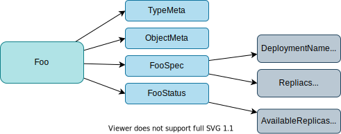

# code-genearator-training

## Overview

[code-generator](https://github.com/kubernetes/code-generator) is Golang code-generators used to implement Kubernetes-style API types (generate deepcopy, clientset, informer, lister)

1. **DeepCopy** is necessary to implement [runtime.Object](https://pkg.go.dev/k8s.io/apimachinery/pkg/runtime#Object) interface.


	```go
	type Object interface {
		GetObjectKind() schema.ObjectKind
		DeepCopyObject() Object
	}
	```

	> Object interface must be supported by all API types registered with Scheme. Since objects in a scheme are expected to be serialized to the wire, the interface an Object must provide to the Scheme allows serializers to set the kind, version, and group the object is represented as. An Object may choose to return a no-op ObjectKindAccessor in cases where it is not expected to be serialized.

1. **Clientset** is to access a custom resource in Kubernetes API

	[clientset](https://github.com/kubernetes/client-go/blob/master/kubernetes/clientset.go) is to access built-in Kubernetes API.

	```go
	// Clientset contains the clients for groups. Each group has exactly one
	// version included in a Clientset.
	type Clientset struct {
		*discovery.DiscoveryClient
		admissionregistrationV1      *admissionregistrationv1.AdmissionregistrationV1Client
		admissionregistrationV1beta1 *admissionregistrationv1beta1.AdmissionregistrationV1beta1Client
		internalV1alpha1             *internalv1alpha1.InternalV1alpha1Client
		appsV1                       *appsv1.AppsV1Client
		appsV1beta1                  *appsv1beta1.AppsV1beta1Client
		appsV1beta2                  *appsv1beta2.AppsV1beta2Client
		...
	}
	```

	For custom Kubernetes API, need its onw clientset.

	```go
	// Clientset contains the clients for groups. Each group has exactly one
	// version included in a Clientset.
	type Clientset struct {
		*discovery.DiscoveryClient
		exampleV1alpha1 *examplev1alpha1.ExampleV1alpha1Client
	}
	```

	Usage:

	```go
	client, e := v1alpha1.NewForConfig(config)
	client.Foos("default").List(context.TODO(), metav1.ListOptions{})
	```

1. **Lister** to *list* custom resources in a in-memory `cache.Indexer` with `List` function.

	```go
	// FooLister helps list Foos.
	// All objects returned here must be treated as read-only.
	type FooLister interface {
		// List lists all Foos in the indexer.
		// Objects returned here must be treated as read-only.
		List(selector labels.Selector) (ret []*v1alpha1.Foo, err error)
		// Foos returns an object that can list and get Foos.
		Foos(namespace string) FooNamespaceLister
		FooListerExpansion
	}

	// fooLister implements the FooLister interface.
	type fooLister struct {
		indexer cache.Indexer
	}
	```

1. **Informer** is used to capture changes of a target custom resource, which is usually used in a custom controller.

	```go
	// FooInformer provides access to a shared informer and lister for
	// Foos.
	type FooInformer interface {
		Informer() cache.SharedIndexInformer
		Lister() v1alpha1.FooLister
	}

	type fooInformer struct {
		factory          internalinterfaces.SharedInformerFactory
		tweakListOptions internalinterfaces.TweakListOptionsFunc
		namespace        string
	}
	```

## 1. Initialize

```
mkdir code-generator-training && cd code-generator-training
git init
go mod init code-generator-training
```

## 2. Install

```
go get k8s.io/apimachinery@v0.24.2
go get k8s.io/client-go@v0.24.2
go get k8s.io/code-generator@v0.24.2
```

## 3. Define Custom Resource type

1. Make directory.

	```
	mkdir -p pkg/api/example.com/v1alpha1
	```

1. Add `pkg/api/example.com/v1alpha1/doc.go`

	```go
	// +k8s:deepcopy-gen=package
	// +groupName=example.com

	package v1alpha1
	```


1. Add `pkg/api/example.com/v1alpha1/types.go`

	

	<details><summary>pkg/api/example.com/v1alpha1/types.go</summary>

	```go
	package v1alpha1

	import (
		metav1 "k8s.io/apimachinery/pkg/apis/meta/v1"
	)

	// +genclient
	// +k8s:deepcopy-gen:interfaces=k8s.io/apimachinery/pkg/runtime.Object

	// Foo is a specification for a Foo resource
	type Foo struct {
		metav1.TypeMeta   `json:",inline"`
		metav1.ObjectMeta `json:"metadata,omitempty"`

		Spec   FooSpec   `json:"spec"`
		Status FooStatus `json:"status"`
	}

	// FooSpec is the spec for a Foo resource
	type FooSpec struct {
		DeploymentName string `json:"deploymentName"`
		Replicas       *int32 `json:"replicas"`
	}

	// FooStatus is the status for a Foo resource
	type FooStatus struct {
		AvailableReplicas int32 `json:"availableReplicas"`
	}

	// +k8s:deepcopy-gen:interfaces=k8s.io/apimachinery/pkg/runtime.Object

	// FooList is a list of Foo resources
	type FooList struct {
		metav1.TypeMeta `json:",inline"`
		metav1.ListMeta `json:"metadata"`

		Items []Foo `json:"items"`
	}
	```

	</details>

1. Make `go.mod` consistent with the source code.
	```
	go mod tidy
	```

## 4. Generate Codes with code-generator

### 4.1. Prepare code-generator

1. Clone https://github.com/kubernetes/code-generator.git

	```
	git clone https://github.com/kubernetes/code-generator.git
	```

	In this repo, the repo is added as submodule.

1. Usage: `generate-groups.sh <generators> <output-package> <apis-package> <groups-versions> ...`

	- `generators`: commna separateed (`deepcopy,defaulter,client,lister,informer`) or `"all"`
	- `output-package`: the output package name
	- `apis-package`: the external types dir
	- `groups-versions`: `"groupA:v1,v2 groupB:v1 groupC:v2"` (relative to `apis-package`)

### 4.2. Generate deepcopy

1. Generate DeepCopy by running `generate-groups.sh`.

	```shell
	code-generator/generate-groups.sh deepcopy code-generator-training/pkg/client code-generator-training/pkg/api example.com:v1alpha1 --go-header-file code-generator/hack/boilerplate.go.txt --output-base $(pwd)/..
	```

	Output:

	```
	Generating deepcopy funcs
	```

	Generated files: `pkg/api/example.com/v1alpha1/zz_generated.deepcopy.go`

1. Update go.mod.

	```
	go mod tidy
	```

1. Add test.

	1. Create Foo with replicas to 3.
	1. Copy and deepcopy.
	1. Expect replicas to be 3 for copied and deepcopied one.
	1. Update `replicas` to 5.
	1. Expect replicas to be 5 for copied one.
	1. Expect replicas to be 3 for deepcopied one.

	```go
	package main

	import (
		examplecomv1alpha1 "code-generator-training/pkg/api/example.com/v1alpha1"
		"testing"
	)

	func TestReplicas(t *testing.T) {
		beforeNum := 3
		afterNum := 5
		replica := int32(beforeNum)
		foo := examplecomv1alpha1.Foo{
			Spec: examplecomv1alpha1.FooSpec{
				DeploymentName: "test",
				Replicas:       &replica,
			},
		}

		copiedFoo := foo
		deepCopiedFoo := foo.DeepCopy()

		checkReplica(t, int32(beforeNum), *copiedFoo.Spec.Replicas)
		checkReplica(t, int32(beforeNum), *deepCopiedFoo.Spec.Replicas)

		replica = int32(afterNum)

		checkReplica(t, int32(afterNum), *copiedFoo.Spec.Replicas)
		checkReplica(t, int32(beforeNum), *deepCopiedFoo.Spec.Replicas)
	}

	func checkReplica(t *testing.T, want, got int32) {
		if want != got {
			t.Errorf("want %d, got %d", want, got)
		}
	}
	```

1. Run test.

	```
	go test -v
	=== RUN   TestReplicas
	--- PASS: TestReplicas (0.00s)
	PASS
	ok      code-generator-training 0.165s
	```

## 4.3. Generate client

1. Generate clientset by running `generate-groups.sh`.

	```
	code-generator/generate-groups.sh client code-generator-training/pkg/client code-generator-training/pkg/api example.com:v1alpha1 --go-header-file code-generator/hack/boilerplate.go.txt --output-base $(pwd)/..
	```

	Generated file:

	```
	pkg/client/clientset/versioned/
	├── clientset.go
	├── doc.go
	├── fake
	│   ├── clientset_generated.go
	│   ├── doc.go
	│   └── register.go
	├── scheme
	│   ├── doc.go
	│   └── register.go
	└── typed
		└── example.com
			└── v1alpha1
				├── doc.go
				├── example.com_client.go
				├── fake
				│   ├── doc.go
				│   ├── fake_example.com_client.go
				│   └── fake_foo.go
				├── foo.go
				└── generated_expansion.go

	6 directories, 14 files
	```

	[kubernetes/clientset.go](https://github.com/kubernetes/client-go/blob/master/kubernetes/clientset.go) is to access built-in Kubernetes API. To enable to access custom Kubernetes API, its own clientset [pkg/client/clientset/versioned/clientset.go](pkg/client/clientset/versioned/clientset.go) is necessary.

	```go
	// Clientset contains the clients for groups. Each group has exactly one
	// version included in a Clientset.
	type Clientset struct {
		*discovery.DiscoveryClient
		exampleV1alpha1 *examplev1alpha1.ExampleV1alpha1Client
	}
	```

	The generated codes also include methods for basic operations (Get, List, Create, Update, Patch, Delete, DeleteCollection, Watch).


	But if you try to use it, you would get the following error:

	```
	# code-generator-training/pkg/client/clientset/versioned/scheme
	pkg/client/clientset/versioned/scheme/register.go:35:18: undefined: v1alpha1.AddToScheme
	```

1. Register the CRD with `api/example.com/v1alpha1/register.go`.

	```go
	/*
	Copyright 2017 The Kubernetes Authors.

	Licensed under the Apache License, Version 2.0 (the "License");
	you may not use this file except in compliance with the License.
	You may obtain a copy of the License at

		http://www.apache.org/licenses/LICENSE-2.0

	Unless required by applicable law or agreed to in writing, software
	distributed under the License is distributed on an "AS IS" BASIS,
	WITHOUT WARRANTIES OR CONDITIONS OF ANY KIND, either express or implied.
	See the License for the specific language governing permissions and
	limitations under the License.
	*/

	package v1alpha1

	import (
		metav1 "k8s.io/apimachinery/pkg/apis/meta/v1"
		"k8s.io/apimachinery/pkg/runtime"
		"k8s.io/apimachinery/pkg/runtime/schema"
	)

	// SchemeGroupVersion is group version used to register these objects
	var SchemeGroupVersion = schema.GroupVersion{Group: "example.com", Version: "v1alpha1"}

	// Kind takes an unqualified kind and returns back a Group qualified GroupKind
	func Kind(kind string) schema.GroupKind {
		return SchemeGroupVersion.WithKind(kind).GroupKind()
	}

	// Resource takes an unqualified resource and returns a Group qualified GroupResource
	func Resource(resource string) schema.GroupResource {
		return SchemeGroupVersion.WithResource(resource).GroupResource()
	}

	var (
		SchemeBuilder = runtime.NewSchemeBuilder(addKnownTypes)
		AddToScheme   = SchemeBuilder.AddToScheme
	)

	// Adds the list of known types to Scheme.
	func addKnownTypes(scheme *runtime.Scheme) error {
		// Add both of the resources Foo and Foolist
		scheme.AddKnownTypes(SchemeGroupVersion,
			&Foo{},
			&FooList{},
		)
		metav1.AddToGroupVersion(scheme, SchemeGroupVersion)
		return nil
	}
	```

1. Register CRD to apiserver.

	```
	kubectl apply -f config/crd/foo.yaml
	```

1. List Foo resources with the generated clientset (`main.go`).

	```go
	package main

	import (
		"code-generator-training/pkg/client/clientset/versioned/typed/example.com/v1alpha1"
		"flag"
		"fmt"
		"path"

		"context"

		metav1 "k8s.io/apimachinery/pkg/apis/meta/v1"
		"k8s.io/client-go/tools/clientcmd"
		"k8s.io/client-go/util/homedir"
	)

	var (
		masterURL  string
		kubeconfig string
	)

	func main() {
		flag.Parse()
		config, e := clientcmd.BuildConfigFromFlags(masterURL, kubeconfig)
		if e != nil {
			panic(e.Error())
		}
		// v1alpha1 package
		client, e := v1alpha1.NewForConfig(config)
		if e != nil {
			panic(e.Error())
		}
		fooList, e := client.Foos("default").List(context.TODO(), metav1.ListOptions{})
		if len(fooList.Items) == 0 {
			fmt.Println("Foo not found.")
		}
		for i, foo := range fooList.Items {
			fmt.Printf("%d\t%s\t%d\n", i, foo.Name, *foo.Spec.Replicas)
		}
	}

	func init() {
		home := homedir.HomeDir()
		flag.StringVar(&kubeconfig, "kubeconfig", path.Join(home, ".kube", "config"), "Path to a kubeconfig. Only required if out-of-cluster.")
		flag.StringVar(&masterURL, "master", "", "The address of the Kubernetes API server. Overrides any value in kubeconfig. Only required if out-of-cluster.")
	}
	````

1. Check.
	1. Create a custom resource. `kubectl apply -f config/example/foo-sample.yaml`
	1. Run `main.go`:
		```
		go run main.go
		0       foo-sample      2
		```
	1. Delete custom resource. `kubectl delete -f config/example/foo-sample.yaml`
	1. Run `main.go`:
		```
		go run main.go
		Foo not found.
		```

### 4.4. Generate informer and lister

1. Generate informer by running `generate-groups.sh`.

	```
	code-generator/generate-groups.sh informer code-generator-training/pkg/client code-generator-training/pkg/api example.com:v1alpha1 --go-header-file code-generator/hack/boilerplate.go.txt --output-base $(pwd)/..
	```

	Generated files:

	```
	tree pkg/client/informers
	pkg/client/informers
	└── externalversions
		├── example.com
		│   ├── interface.go
		│   └── v1alpha1
		│       ├── foo.go
		│       └── interface.go
		├── factory.go
		├── generic.go
		└── internalinterfaces
			└── factory_interfaces.go

	4 directories, 6 files
	```

1. Generate lister (as informer is dependent on lister)

	```
	code-generator/generate-groups.sh lister code-generator-training/pkg/client code-generator-training/pkg/api example.com:v1alpha1 --go-header-file code-generator/hack/boilerplate.go.txt --output-base $(pwd)/..
	```

	```
	tree pkg/client/listers
	pkg/client/listers
	└── example.com
		└── v1alpha1
			├── expansion_generated.go
			└── foo.go

	2 directories, 2 files
	```

1. Use informer in `main.go`.

	1. Initialize informer with clientset (generated in the previous step)

		```go
		clientset, e := versioned.NewForConfig(config)
		factory := externalversions.NewSharedInformerFactory(clientset, 30*time.Second)
		fooInformer := factory.Example().V1alpha1().Foos()
		```

	1. Set the event handler for `AddFunc`, `UpdateFunc`, and `DeleteFunc`

		```go
		fooInformer.Informer().AddEventHandler(cache.ResourceEventHandlerFuncs{
			AddFunc: func(obj interface{}) {
				key, err := cache.MetaNamespaceKeyFunc(obj)
				if err != nil {
					log.Fatalf("error %v", err)
					return
				}
				fmt.Printf("added %s\n", key)
			},
			UpdateFunc: func(old, new interface{}) {
				key, err := cache.MetaNamespaceKeyFunc(new)
				if err != nil {
					log.Fatalf("error %v", err)
					return
				}
				fmt.Printf("updated %s\n", key)
			},
			DeleteFunc: func(obj interface{}) {
				key, err := cache.MetaNamespaceKeyFunc(obj)
				if err != nil {
					log.Fatalf("error %v", err)
					return
				}
				fmt.Printf("deleted %s\n", key)
			},
		})
		```
	1. Start factory.

		```go
		// start factory
		stopCh := make(chan struct{})
		factory.Start(stopCh)
		<-stopCh
		```

1. Run and check.
	1. Run.
		```
		go run main.go
		Foo not found.
		fooInformer synced
		```

	1. Create custom resource.
		```
		kubectl apply -f config/example/foo-sample.yaml
		```
	1. Check Log.
		```
		added default/foo-sample
		updated default/foo-sample
		```
	1. Delete the custom resource.
		```
		kubectl delete -f config/example/foo-sample.yaml
		```
	1. Check log.
		```
		updated default/foo-sample
		deleted default/foo-sample
		```

For more detail, you can check [informer](https://www.nakamasato.com/kubernetes-training/kubernetes-operator/informer/).

# References
- https://tangxusc.github.io/2019/05/code-generator%E4%BD%BF%E7%94%A8/
- https://github.com/kubernetes/code-generator
- [runtime.Object](https://pkg.go.dev/k8s.io/apimachinery/pkg/runtime#Object)
